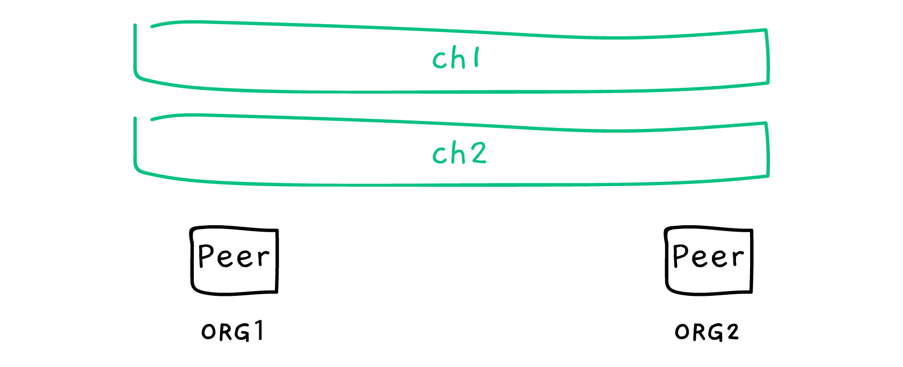
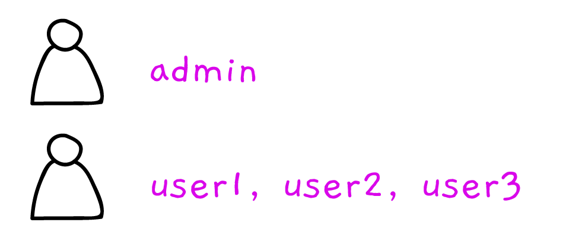

# Development Environment

We have a tool to manage your dev environment easily with some commands.
Once you install [@worldsibu/convector-tool-dev-env](https://www.npmjs.com/package/@worldsibu/convector-tool-dev-env) you will have the folowwing commands available in your `.bin` folder inside the `node_modules`:

- `dev-env-start` - Start the docker containers
- `dev-env-stop` - Stop the docker containers
- `dev-env-init` - Init de docker containers with two channels, 1 admin user and 3 regular users per org
- `dev-env-clean` - Remove all the docker containers and the generated chaincode images
- `dev-env-restart` - Destroy and start your env fresh again
- `user-registry` - Register admin/users

## Basic structures

The development environment you get is made up like this.

**Network topology**. All the containers provisioned.


**Channels**. If you are not that familiar with Fabric, channels are the actual ledgers, you may have multiple. If an organization doesn't belong to a channel, there is no way for them to access the data. 



**Users**. Entities of the network that can be used to similate actual users.



## User Registry

Users in Fabric can have to main roles, admin users (administrators, with high privileges) or regular users (consumers of the blockchain).

### Register Admin

To add new admins, run:

```bash
user-registry add-admin [username] [password] [msp] \
  --keystore ./.hfc-key-store \
  --profile ./network-profile.yaml
```

### Register User

To add new regular users, run:

```bash
user-registry add-user [username] [admin-username] [msp] \
  --role [role] \
  --affiliation [affiliation] \
  --keystore ./.hfc-key-store \
  --profile ./network-profile.yaml
```

## Include them in your project

To make it easier to manage those commands for your specific project, you can include this in your root `package.json`. Be sure to have included the basic packages as seen in [[Getting-Started]].

```json
{
  "scripts": {
    "env:init": "./node_modules/@worldsibu/convector-tool-dev-env/scripts/init.sh",
    "env:start": "./node_modules/@worldsibu/convector-tool-dev-env/scripts/start.sh",
    "env:stop": "./node_modules/@worldsibu/convector-tool-dev-env/scripts/stop.sh",
    "env:restart": "./node_modules/@worldsibu/convector-tool-dev-env/scripts/restart.sh",
    "env:clean": "./node_modules/@worldsibu/convector-tool-dev-env/scripts/clean.sh"
  }
}
```

**Prerequisites**

```bash
npm install -D @worldsibu/convector-{adapter-mock,tool-{dev-env,chaincode-manager}} fabric-client@1.1.2 fabric-ca-client@1.1.2
```
